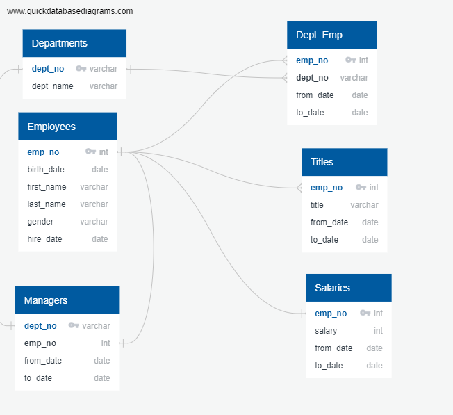

# Pewlett-Hackard-Analysis
This analysis was based on the use of files provided on employees of a fictitious company.  There were six .csv files that had to be uploaded into a new database.  But before creating the database, the analyst drew up an ERD using a website called: QuickDatabase Diagrams.  The image included herein shows the ERD. 

## Methods
Several new tables were created to show 1) the distribution of titles among those ready for retirement, 2) the actual list of employees born between 1/1/1952 and 12/31/1955 that were ostensibly ready for retirement, and 3) the list of potential employees born in 1965 that would be eligible for a mentorship program. Each of these tables were exported as .csv files and exist in the data subfolder of this repository.  To create an unduplicated count of employees for the mentor program, instead of partitioning, which potentially needed many steps, I chose to alter the titles table to create a unique to_date field called to_date_titles, that would enable me to select out only those titles with "9999-01-01" date which is a proxy for current status.  Then, I created the mentor table with unduplicated employees reflective of only current titles.  Here is the actual query used:
SELECT ei.emp_no,
	ei.last_name,
	ei.first_name,
	ei.birth_date,
	ti.title,
	de.to_date
INTO mentees
FROM employees AS ei
INNER JOIN titles AS ti
ON (ei.emp_no = ti.emp_no)
INNER JOIN dept_employee AS de
ON (ei.emp_no = de.emp_no)
WHERE de.to_date = ('9999-01-01')
AND ti.to_date_title = ('9999-01-01')
AND (birth_date BETWEEN '1965-01-01' AND '1965-12-31')
ORDER BY ei.last_name;

## Findings
### Retirees
Based on the three-year range of birth years (1952-1955), there were 33,118 employees potentially retiring in the near future, who were eligible based on longevity (hire date between 1/1/1985 and 12/31/1988) and were currently employed.  Most of these potential retirees fell into the classification of engineer.  This means that there will be a high demand for new engineers in the very near future.  Hopefully, many of these "Baby-Boomers" can stay on as part-time employees, or stay long enough to pass off the baton to the youngsters. My concern is that the salaries earned by these older employees are quite low, and the company will have to raise incoming salaries quite a bit to stay competitive in the technology sector.  For example, some of the engineers are earning less than 60K, very low indeed (not shown herein, but available in the titles_retiring.csv file).  The following graphic depicts the distribution of titles for retiring employees. As can be seen, almost 50% of the potential retirees are engineers. Thus, the impact will be great on the company as these individuals retire.

### Mentors
There are 1,549 employees born in 1965 that could serve in the mentorship role. These employees might be able to train and coach new employees coming on board, as the impact will be great over the next few years as the "Baby-Boomers" start to retire.  Likely, each mentor will also need to be coached and trained, either by senior management or through an outside consulting firm.  This will financially be burdensome, but could offset the loss of so many seasoned employees.  A combination of mentoring and keeping older employees on longer in a part-time role could be useful.

## Implications
I suggest that the HRD department consider an analysis of salaries being earned by the potential retirees and compare them to going market salary trends (GlassDoor can provide benchmarks for engineers and senior engineers by geography).  It appears that PH is way too low in their salaries to remain competitive when the older employees start to retire.
